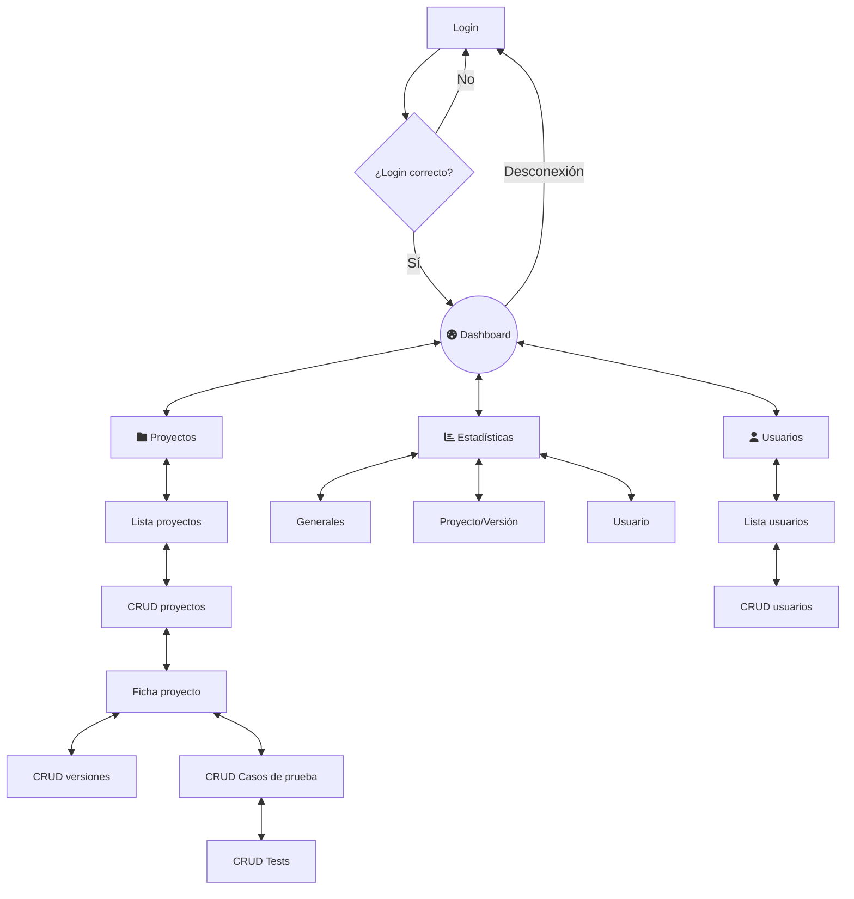
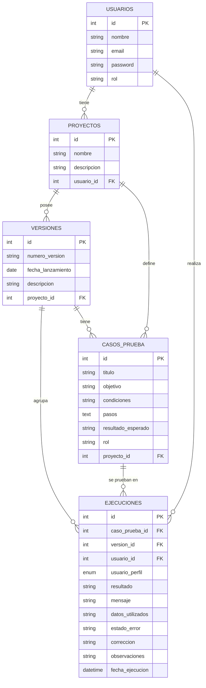

# TestLab

**TestLab** es una aplicación web diseñada para facilitar el registro, ejecución y seguimiento de pruebas de software en entornos de desarrollo. Su objetivo principal es mejorar la trazabilidad de los test y centralizar la información que, tradicionalmente, se gestiona de manera dispersa en hojas de cálculo o documentos.

Actualmente, muchos equipos carecen de un sistema unificado para documentar y controlar los resultados de las pruebas, lo que provoca:

* Falta de organización
* Dificultad para identificar errores recurrentes
* Problemas de comunicación entre desarrolladores, testers y gestores de proyectos

**TestLab** pretende solucionar estas necesidades mediante un sistema estructurado que permite:

* Registrar de forma uniforme los casos de prueba y sus resultados
* Asociar cada prueba a una versión o proyecto concreto
* Consultar el historial de ejecuciones y su trazabilidad
* Generar estadísticas globales sobre el estado de las pruebas
* Mejorar la comunicación interna y la calidad final del software

Los principales beneficiarios son equipos de desarrollo, testers, gestores de proyectos y clientes que deseen una visión clara y actualizada del estado de las pruebas.

## Diagrama de flujo previsto

## Diagrama E-R previsto

